# Almacén Universitario

**Proyecto académico** que ofrece ejemplos y prácticas con bases de datos relacionales con llaves foráneas y subconsultas.

---

## Objetivo

- Crear y manipular bases de datos con SQL.
- Aprender diseño de esquemas, relaciones entre tablas y normalización.
- Practicar consultas (SELECT, JOIN, GROUP BY), transacciones y restricciones.
- Implementar ejemplos en distintos sistemas gestores (MySQL, PostgreSQL, SQLite).

---

## Contenido del repositorio

- `MySQL/` — Scripts `.sql` para crear esquemas de ejemplo, insertar datos, consultas y procedimientos almacenados.
- `PostgreSQL/` — Equivalente de scripts para Postgres.
- `SQLite/` — Bases `.db` de ejemplo junto con scripts o notebooks.
- `README.md` — Este archivo de descripción.

---

## Tecnologías / SGBD

- MySQL / MariaDB
- PostgreSQL
- SQLite
- SQL estándar (DDL, DML, DCL)

---

## Instrucciones para usar

### Para MySQL o MariaDB

```bash
# En consola MySQL o Workbench
SOURCE MySQL/schema.sql;
SOURCE MySQL/data.sql;
```

### Para PostgreSQL

```bash
psql -U tu_usuario -d tu_bd -f PostgreSQL/schema.sql
psql -U tu_usuario -d tu_bd -f PostgreSQL/data.sql
```

### Para SQLite

```bash
sqlite3 ejemplo.db < SQLite/script.sql
```

---

## Ejemplos incluidos

- **Creación de tablas** con claves primarias y foráneas.
- **Inserción de datos** en múltiples tablas con relaciones.
- **Consultas complejas**: JOIN, agregaciones, subconsultas.
- **Transacciones**: BEGIN, COMMIT, ROLLBACK.
---

## Capturas

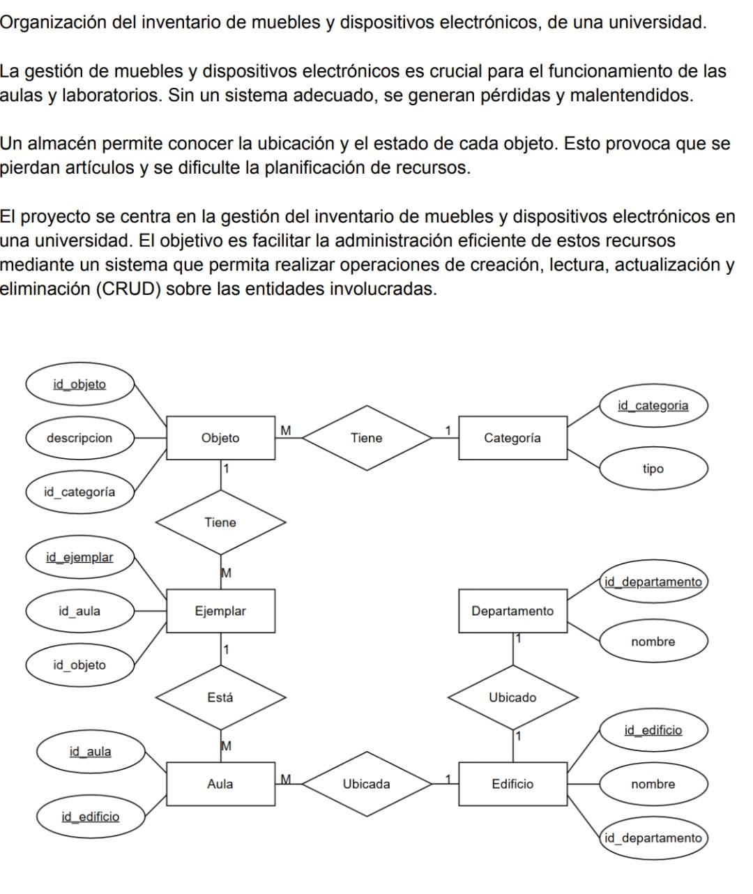
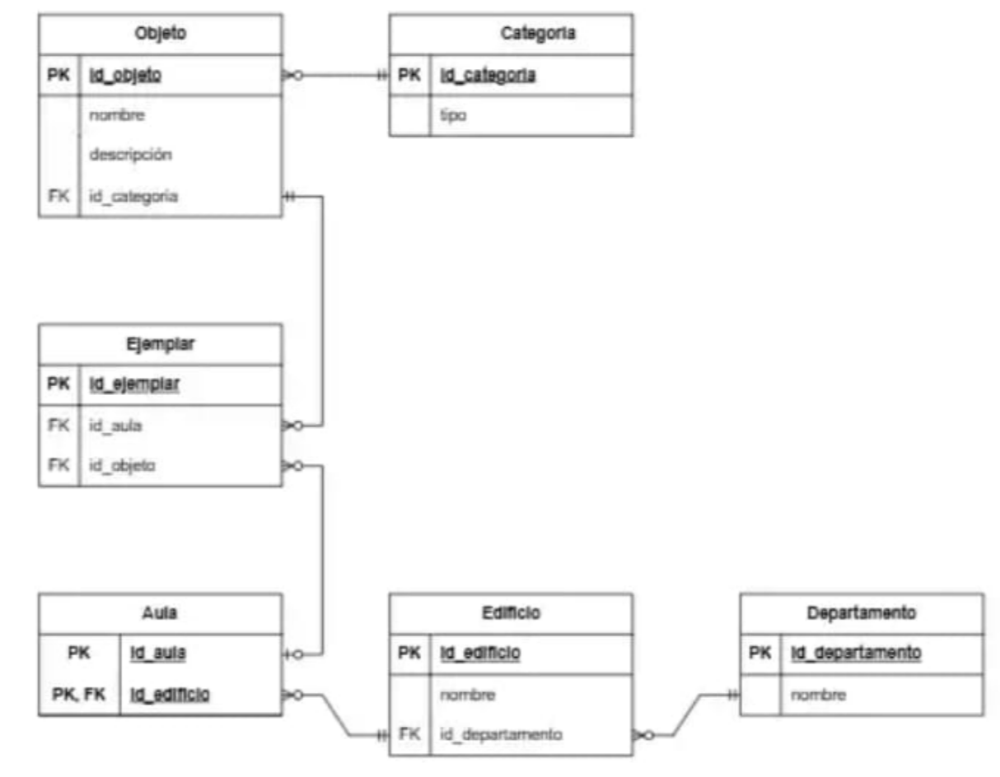
### Departamentos
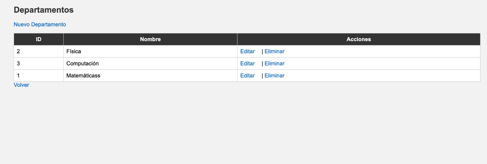
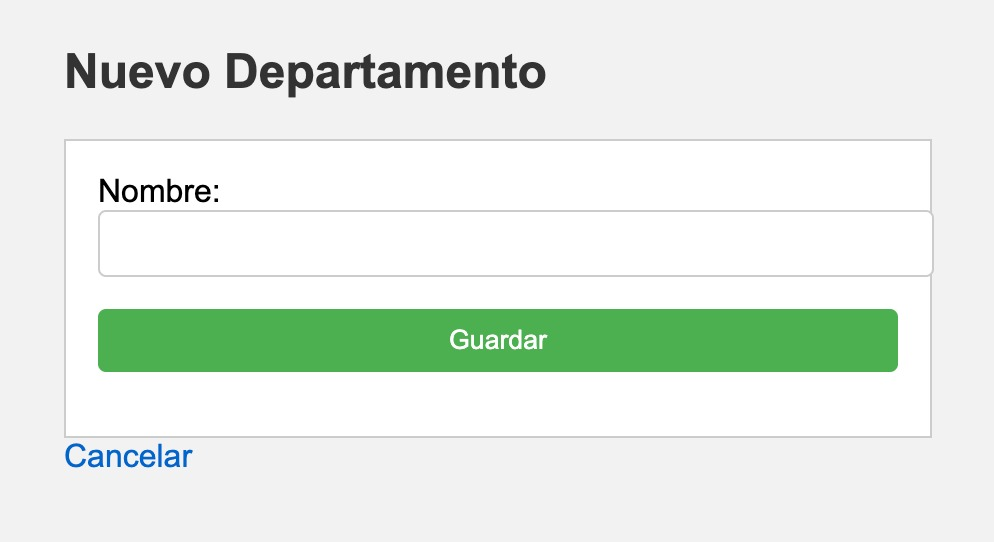
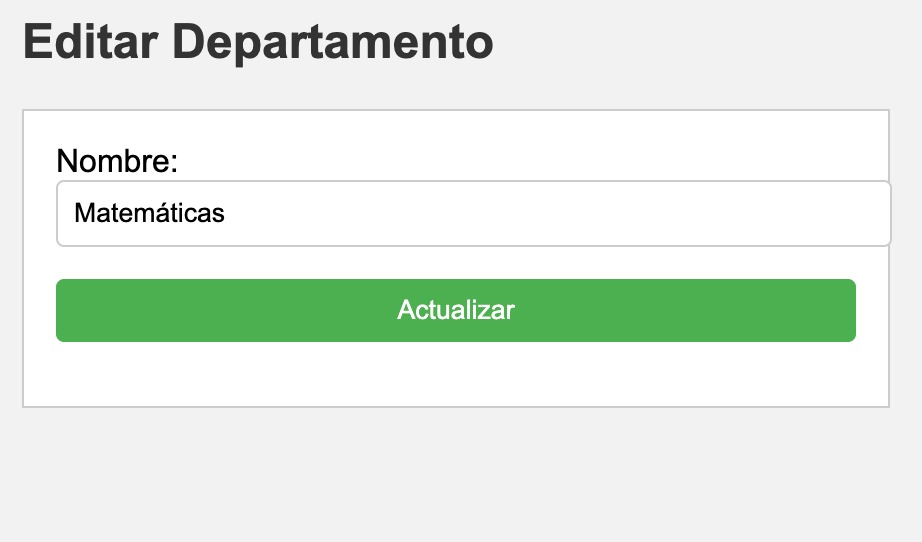

### Categorias
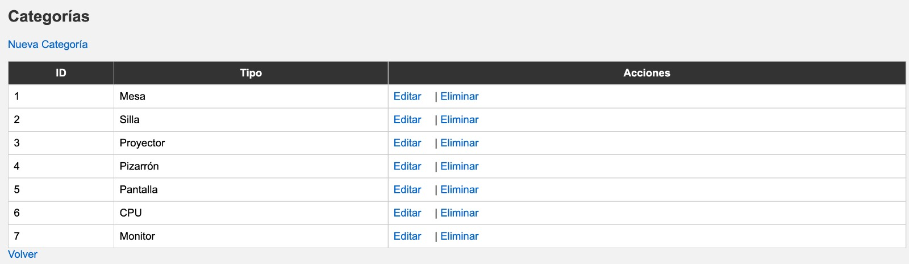

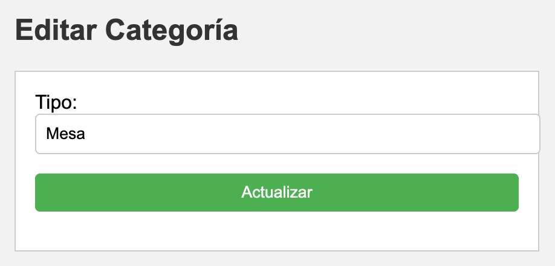

### Objeto
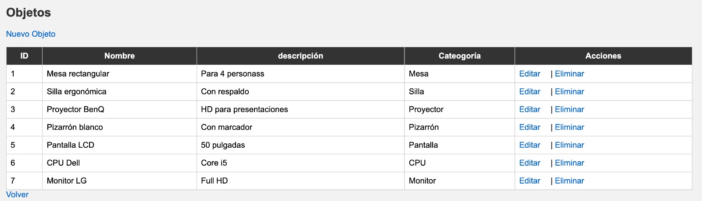
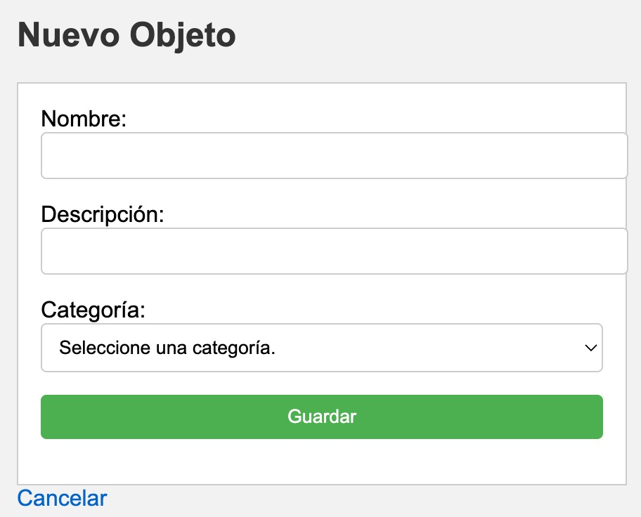
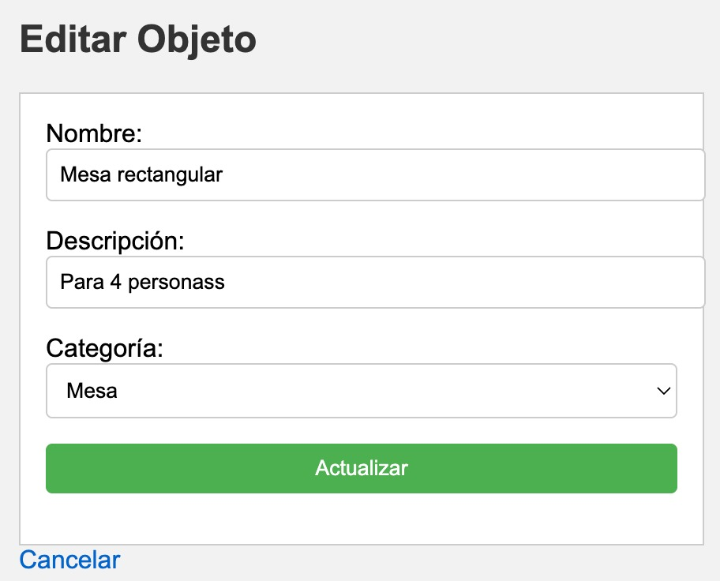

### Edificio

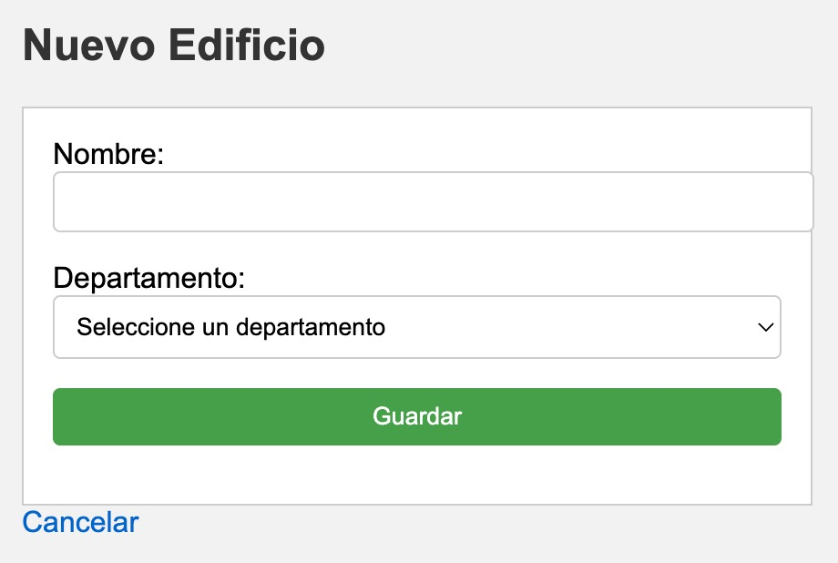
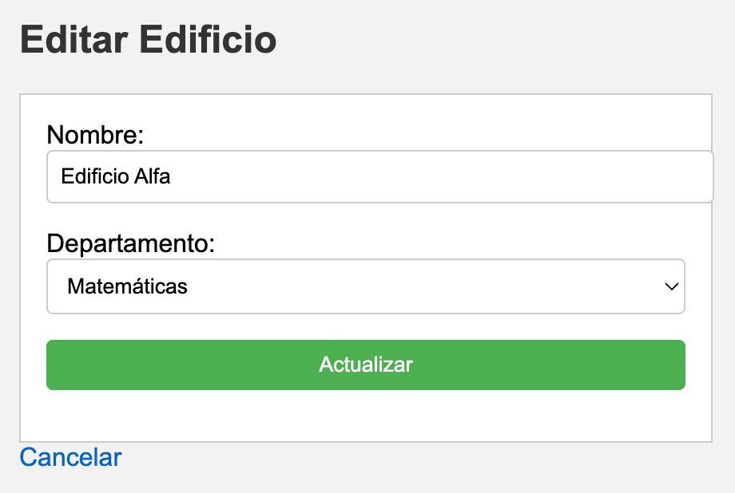

### Ejemplar
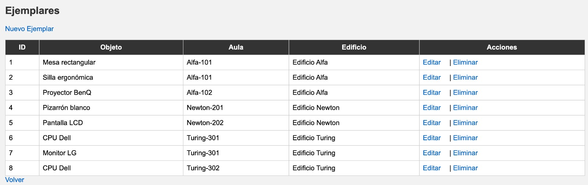

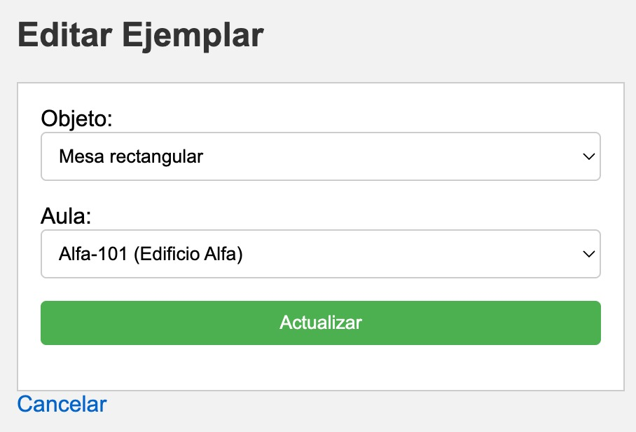
---

## Autores / Colaboradores

- Ana Chenoweth ([@ana-chenoweth](https://github.com/ana-chenoweth))
- Denisse Gabriela Antunez López ([@denisseantunez](https://github.com/denisseantunez))
- Georgina Salcido Valenzuela ([@GeoSV](https://github.com/GeoSV))
- Gustavo Gutierrez Navarro ([GustavoGtz](https://github.com/GustavoGtz))
- Jorge luna Munguia ([cazaroni] https://github.com/cazaroni)

---

## 📄 Licencia

Este proyecto está bajo la licencia MIT. Consulta el archivo [LICENSE](./LICENSE) para más detalles.
